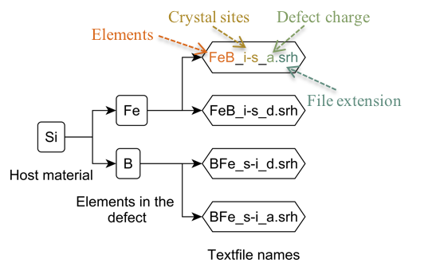

-   [Semiconductor Defects](#semiconductor-defects)
    -   [Referencing](#referencing)
    -   [Linked sites](#linked-sites)
    -   [Contributing](#contributing)
    -   [Shockley Read Hall
        parameterization](#shockley-read-hall-parameterization)
    -   [How information is stored](#how-information-is-stored)
        -   [“.srh” file continence](#srh-file-continence)
    -   [Optical absorption and
        emission](#optical-absorption-and-emission)
        -   [“.opt” file continence](#opt-file-continence)

# Semiconductor Defects

This is an attempt at creating a collection of defect parameters of
semiconductors in plain text. The idea is that plain text should allow
for everyone to be able to access the information for now and into the
future. The information stored in this repository is currently includes
Shockley Read Hall parameterization and optical capture cross section.
These values describe how a defect interacts with electron and holes and
light.

## Referencing

If you use this, please reference our work:

M. Juhl et al., “AN OPEN SOURCE BASED REPOSITORY FOR DEFECTS IN
SILICON,” presented at the 7th World Conference on Photovoltaic Energy
Conversion, Hawaii, 2018.

It can be found at the following websites: 1.
[ieee](https://ieeexplore.ieee.org/document/8547621) 2.
[researchgate](https://www.researchgate.net/publication/326478648_An_Open_Source_Based_Repository_For_Defects_in_Silicon)
3.
[semanticscholar](https://www.semanticscholar.org/author/Mattias-K.-Juhl/32390663)

## Linked sites

This repository is searchable on
[PVlighthouse](https://www.pvlighthouse.com.au/semiconductor-defects-library).
Inputs for seaching are common parameters determined to parameterise the
emission rate of a specific carrier, being electron or holes, determined
by DLTS. The parameters, *B* and *E**d**a*, are determined
from the follow a linear fit to

*l**n*(*e*/*T*2) = *l**n*(*B*) − *f**r**a**c**E**d**a**k**T*

The fit is performed for emission rates of 1,10,1000,1000 1/s. The
temperature corresponding to these emission rates is caculated from
relationship provided in publications or calcualted from defect
parameters from the same publication. The relationship between published
defect paramters, the emission rate and temeperature is

$e = \\frac{N v\_{th}}{300^2} \* T^2 \\sigma\_{a} e^{\\frac{E\_{da}}{kT}}$

$e = N v\_{th} \\sigma\_{a} e^{\\frac{E\_{da}}{kT}}$

where: *e* is the emission rate of a carrier from a defect in units of
seconds; *N* is the effective density of states of the appropriate band
at room temperatureof the appropriate, taking values of 2.89e19
cm-3 or 3.14e19 cm-3 for the conduction band and
valance band respectivly; *v**t**h* is the thermal velocity
of the appropiate carrier, taking values 2.046e7 cm/s or 1.688e7 cm/s
for electrons and holes respectivly; *s**i**g**m**e**a* is
the apparent capture cross section of the defect for the appropriate
carrier; *E**d**a* is the apparent energy level for the
defect, with units of electron voltage; *B* represents the emission rate
at inifited temperature divided by temperature squared, with units
seconds per Kelvin squared; *k* is boltzman constant, with units
electron volts per Kelvin; and *T* is temperature, with units of Kelvin.

The calculation of the temperature from emission rates and provided
defect paramters, is made without itteration through the use of the
pretty cool lambert W function.

## Contributing

There are two ways to contribute.

1.  Fork this repository, make your changes and push it back
2.  Fill in this [csv file](example.csv) and email it to
    mattias.juhl@gmail.com. For details of what each category means
    please see this readme.
3.  Email the papers to mattias.juhl@gmail.com

Details about how to enter data are found below.

## Shockley Read Hall parameterization

The Shockley Read Hall parameterisation of a defect assumes that there
is an level within the forbidden region in a semiconductor’s through
which electrons and holes can pass. A schematic of such a defect is
shown in Figure [1](#fig:SRH).

<figure>
<figcaption aria-hidden="true">Figure 1: Shockley Read Hall description of a single defect level. Here Ec is the condition band edge, Ev is the valance bade edge, Ei is the intrinsic level of the semiconductor, Ed is the energy level of the defect, G is the generation of free carriers, k is Boltzmann constant, and T is the temperature. The remaining terms are specific for electrons and holes as depicted by their subscripts being e and h, respectively. These remaining terms are: c is a capture rate of particles, e is an emission rate of particles, σ is the capture cross section, n is the number of free particles (electrons in the conduction band or holes in the valance band), Nd is the number of defects filled with a spectific particle</figcaption>
</figure>

*Shockley Read Hall description of a single defect level. Here
Ec is the condition band edge, Ev is the valance
bade edge, Ei is the intrinsic level of the semiconductor,
Ed is the energy level of the defect, G is the generation of
free carriers, k is Boltzmann constant, and T is the temperature. The
remaining terms are specific for electrons and holes as depicted by
their subscripts being e and h, respectively. These remaining terms are:
c is a capture rate of particles, e is an emission rate of particles, σ
is the capture cross section, n is the number of free particles
(electrons in the conduction band or holes in the valance band),
Nd is the number of defects filled with a specific particle*

The Shockley Read Hall parameterization of a defect has three values,
all of which should be assumed to be temperature dependent:

-   Ed: The energy level of the defect. We capture this value
    as reported in literature. This is usually reported as a distance to
    another energy level, i.e. The conduction band edge (Ec),
    the valance band edge (Ev), or the intrinsic energy level
    (Ei). Unfortunately, not all techniques measure this
    value the same way, and it is not always clear exactly what is meant
    by this value.
-   σe: The capture cross section for electrons.
-   σh: The capture cross section for holes

A 4th value that is recorded as a SRH parameter is the ratio of the
electon to hole capture cross section, i.e
k=σe/σh. This is recorded as lifetime spectroscopy
usually provides a measure of k rather than absolute capture cross
sections.

Unfortunatley these values are not often reported. To allow the capture
of partial data from DLTS, as its the largest contributor to data, there
are several other definitions of energy levels. The notiation used here
is the same as used within the repository, e.g. plain text:

-   Ed\_a: (Ed,a) The apparent or thermal activation energy.
    This is an energy extracted from the arhenious plot of DLTS data.

-   Ed\_h: (Ed,h) The enthalpy of the defect. This is the
    Ed,a that has had the impact of a temperature dependent
    capture cross section removed. For this to occur it is required that
    a direct measurement of the capture rate is performed at several
    temperatures.

-   Ed: (Ed) The energy level, or Gibb’s free energy of the
    defect. It accounts for the change in entropy of the defect:

    *Ed = Ed,h - T×ΔS*

    The energy level can be calculated directly from the emission and
    capture rates.

TODO: ‘k’ is obviously poor notation, but it is currently the standard
notation. This should be improved both here and in literature.

## How information is stored

Information is stored in both the file structure and the finial text
files within the repository. The file structure of the repository is
illustrated in Figure [2](#fig:structure). The repository has two nested
folders, with the text file in the finial folder.

<figure>
<figcaption aria-hidden="true">Figure 2: Folder and file structure of the repository. Square boxes represent a folder, while hexagonal boxes represent text files.</figcaption>
</figure>

*Folder and file structure of the repository. Square boxes represent a
folder, while hexagonal boxes represent text files.*

The naming convention for the file are now detailed. The first element
written corresponds to the folder that the file is in. Following this
all the elements are written in alphabetical order.

The crystal site abbreviation currently used are:

-   s: substitutional
-   i: interstitial
-   v: vacancy
-   p: precipitate

The abbreviations for the defect charge state are:

-   aa: double acceptor. The defect can change been a net change of -2
    and -1.
-   a: acceptor. The defect can change been a net charge of -1 and 0.
-   d: donor. The defect can change been a net charge of 0 and 1.
-   dd: double donor. The defect can change been a net charge of 1
    and 2.
-   ddd: triple donor. The defect can change been a net charge of 2
    and 3.

The “.srh” and “.opt” files is an ASCII file written in plain text. The
structure of its contents is described in the following subsection.

### “.srh” file continence

The contents of the finial file, and naming convention is now described.
These are all optional inputs. To have an entry the minimum is the
params section.

The text file is written with a
[yaml](https://en.wikipedia.org/wiki/YAML) syntax. This makes it both
easy for a human and computer to read! An example is found in
W\_s\_s.srh:

    graff1995_1:
      title: Metal impurities in silicon-device fabrication
      DOI: 10.1007/978-3-642-97593-6
      measurement_technique: Review of DLTS
      measurement_details:
        T: 100 K
        Ur: -5 V
        Ub: -2 V
        tp: 10 ms
        Rw: 0.05 s
      sample:
        growth: CZ
        dopant: boron
        resistivity: 1
        incorporation: ion implantation
      comments: Taken from table 1 in the appendix. The table only provides
          the majority carrier capture cross section. The majority carrier has
          been estimated from the position of the defect level. e.g. if higher
          than the intrinsic level, it is assume the majority carrier was electrons.
      params:
        Ed_a: Ev+0.41 # units of Ev
        dEd: 0.01 # units of Ev
        sigma_e: 1e-15 * exp(-3/kT) # units of cm^2

The initial value graff1995\_1, is the author year notation commonly
used for publications. The \_1 indicates that in the same publication
two values were published for this impurity. If there author year
notation is not unique the second name is appended with a letter without
an underscoe, e.g. graff1995a. This can then be appended with the
underscore number as above if it reports several values.

#### title

The title of the paper publication.

#### DOI

The Digital Object Identifier (DOI) for the file.

#### ISBN

The international standard book number.

#### ISSN

The international standard serial number.

#### sample

Sample provides a nested heading to provide sample details. This include
the growth of the material, the dopant, and the resistivity (Ω.cm). An
example is:

    sample:
      growth: CZ
      dopant: boron
      resistivity: 1
      incorporation: ion implantation

TODO: The problem with this notation is when several samples are used. A
better way is to recorded this information.

options:

-   growth: CZ, FZ, cast
-   dopant: elemental names all lower case and comma separated,
    e.g. boron, phorphous, or aluminum
-   resistivity: resistivity in Ω.cm. If several samples are used comma
    separate them. If a range of resistivities are provided simply write
    that range, e.g. 3, 50, 1-10
-   incorporation: how the defect was placed into the sample for study.
    Options include: melt, thermal, ion implantation and radiation

The choices for incorporation are:

     * ion implantation: as the name suggests
     * ingot: This means it is incorporated during ingot growth
     * thermal: This means it is incorporated into the wafter with a thermal step
     * quenched: Refers to a fast cooling after thermal incorporation.

#### measurement\_technique

There are a range of techniques that have been used to determine these
defect properties. If several techniques are used, they are just comma
separated. We also provide the ability to put in limited experimental
data, and measurement conditions. These are recorded in the repository
using the following abbreviation:

1.  [DLTS](https://en.wikipedia.org/wiki/Deep-level_transient_spectroscopy):
    Deep level transient spectroscopy. There are many variants on DLTS,
    again these are separated by providing different suffixes, being:
    -   Mo - minority carrier based DLTS where the excess minority
        carriers are excited with photons of energy larger than the
        bandgap of the semiconductor.
    -   Me - minority carrier based DLTS where the excess minority
        carriers are excited by an electrical bias.
    -   L - Laplace DLTS
    -   D - Double correlations DLTS
    -   Dp - Double pulse DLTS. This allows values to be extracted that
        are close to zero field values.
    -   Cc - constant capacitance DLTS. This is performed when the
        defect density is of a similar order of magnitude to the doping
        density.
    -   Cr - the capture cross section was used to determine the capture
        cross-section. If this is not done, the capture cross sections
        are apparent capture cross sections.
    -   F - corrected for the impact of electric field

We also include the ability to capture specific measurement details. for
DLTS this include:

-   Ur - Reverse bias voltage
-   Up - Reverse bias pulse
-   tp - Reverse bias pulse length
-   Rw - rate window.
-   T - approximate temperature of the peak

1.  CV: Capacitance voltage. The major difference with DLTS is that this
    is not a transient measurement.
    -   O - An optical biased technique where sub band-gap light was
        used to investigate a defect. This is also known as
        photo-capacitance
    -   T - The temperature was varied
    -   F - vary frequency
2.  TS: Thermal stimulated spectroscopy. This is when the sample
    temperature is increased and a value is monitored. The sample is not
    subjected to a varied biased.
    -   I - current
    -   C - capacitance
3.  [Hall](https://www.nist.gov/pml/engineering-physics-division/popular-links/hall-effect/hall-effect):
    Temperature dependent ionized dopant concentration via the hall
    effect.
4.  DC: diode current: Measurement of the current from a device.
    Suffixes include:
    -   S - spectral
    -   I - impurity effect. The defect level occupation is changed
        through sub band-gap illumination. It can not separate between
        electron and hole emission.
    -   T - transient dark current measurement. This includes
        measurement of the reversed biased and the time constant and
        magnitude of the change in dark current is determined.
5.  PC: Measurement of the photoconductivity from a device. Suffixes
    include:
    -   S - spectral
    -   Tr - measurement of trapping time constants
    -   N - samples with varying number of defects
6.  SCP: Solar cell performance. This involves making solar cells from
    contaminated material and evaluating the impact of the impurity on
    the finial device performance.
7.  Res: Resistivity measurements: Suffixes
    -   T - temperature
8.  LS: Lifetime spectroscopy. This can be performed in different ways.
    These ways are depicted as suffixes, being:
    -   D - doping dependent,
    -   I - represents Injection dependent,
    -   N - samplings with varying number of defects. Unlike other
        techniques the number of defects affects the measured value.
    -   T - temperature dependent
    -   M - accounting for a single defect having multiple levels
    -   G - generation lifetime.

#### measurement\_data

If the raw measurement data can be decomposed into a small data set,
this is the section for it!. This is often done for
[DLTS](http://www.laplacedlts.eu/defect/) with temperature and emission
rate. An example is talken from the [DLTS
database](http://www.laplacedlts.eu/defect/) for the gold acceptor and
is entered as follows:

    measurement_data:
      T: 229.3, 248.5, 271.3, 298.4
      e: 1, 10, 100, 1000

At this stage no other raw data is provided.

#### comments

Any comments about the file that maybe helpful.

#### params

This contains the published SRH parameterisation. As stated before the
Shockley Read-Hall parameters captured are: “Ed” the energy level of the
defect, “simga\_e” the electron capture cross section, “sigma\_h” the
hole capture cross section, and “k” the ratio of the capture cross
sections. k is captured as this is the value directly measured in
lifetime spectroscopy, and thus allows easy entry into the database
without the assumption of capture cross-sections from other
publications. An example of an entry is:

    params:
      Ed: Ev+0.3 # units of eV
      dEd: -0.1, 0.53 # units of eV
      sigma_h: 3.9e-16 * exp(-0.045/kT) # uunits of cm
      dsigma_h: 1e-13 # units of cm^2
      k: 10 # unitless

The energy level of the defect is usually measured relative to the
conduction band edge, or valence band edge. These values are recorded
here in electron volts as “Ev+0.38”. The capture cross section are
generally temperature dependent values, and reported in cm2.
The temperature dependence is using standard scientific notation,
e.g. the temperature dependence of σh for interstitial iron
acting as a donor is recorded under “sigma\_h” as “3.9e-16 \*
exp(-0.045/kT)”. Published errors on these values are also able to be
captured with the entry key being the parameter the the prefix “d”,
e.g. the error in Ed is recorded under dEd.
Symmetric error values are recorded through listing a single number,
while asymmetric errors are comma separated starting with the negativity
error value. For example, to enter the error reports for Cobalt’s
acceptor capture cross-sectional ratio (k) being -0.1 and +0.53, it is
entered under the dk as “-0.1, 0.53”.

## Optical absorption and emission

Similar to the electrical or thermal transitions, defects are able to
absorb or emit light. This section will describe how we will store this
information. We also limit this section to process which move an
electron or hole between a band (conduction or valance) and a defect.
There are other process which involve absorption of light by the defect
such as absorption by vibrational modes.

These details are saved in an “.opt” file, in yaml format. The details
saved are currently under discussion. They could include:

1.  Raw optical capture cross section data
2.  Fitted models to this data

### “.opt” file continence

The contents of the finial file, and naming convention is now described.
There are all optional inputs. To have an entry the minimum is the
params section.

The text file is written with a
[yaml](https://en.wikipedia.org/wiki/YAML) syntax. This makes it both
easy for a human and computer to read! An example is found in
W\_s\_s.srh:

    okuyama1979:
      title: Photoionization cross-sections and energy levels of gold, iron,
       platinum, silver, and titanium in silicon
      DOI: 10.1007/BF02652402
      comments: A_e was extracted from figure 2 and manually fit. The change in
       refractive index was not determined. Between 0.77 and 0.8eV in Fig. 2
       there is scatter from the Lucovsky line but this may be caused by a
       change from a germanium to a silicon filter in this range. Defect
       concentration determined with CV(T).
      measurement_technique: Bo-EQE
      temperature: 77.15
      Fit:
        form: one
        A_e: 7.27e-16 # units of cm
        power1: 3/2 # unitless
        Ed: 0.77 # units of eV
        power2: 3

The initial value graff1995\_1, is the author year notation commonly
used for publications. The \_1 indicates that in the same publication
two values were published for this impurity. If there author year
notation is not unique the second name is appended with a letter rather
than a number, e.g. graff1995\_a.

the current fitted forms are:

1.  Lucovsky: A x (E-Ed) power1/E
    power2
